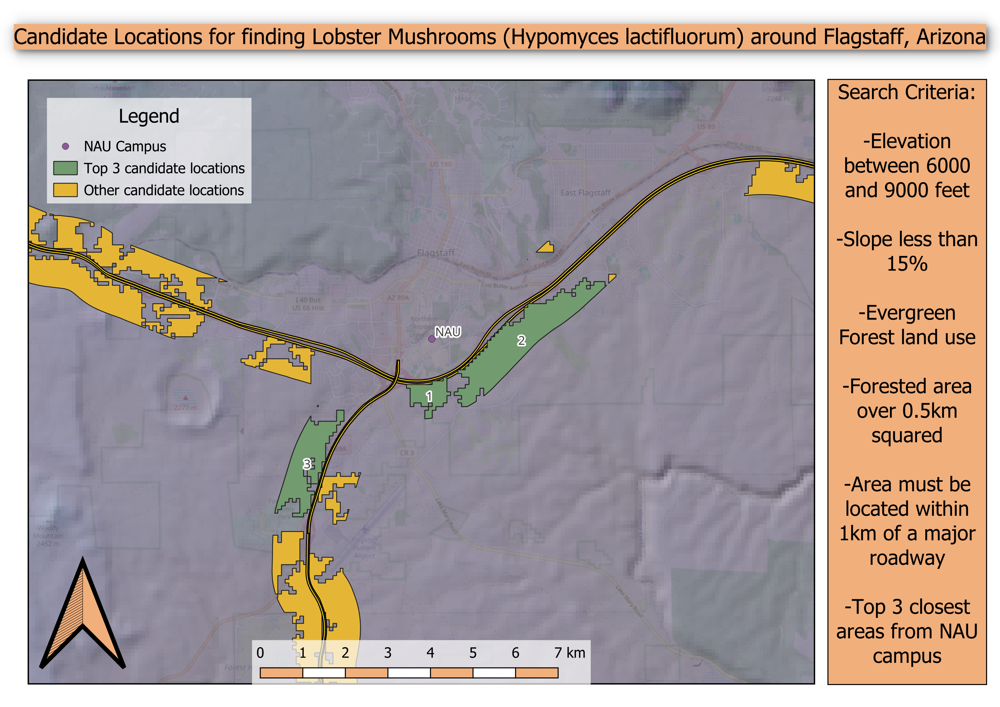

# Lobster Mushroom Habitat Suitability Analysis  
*Modeling Suitable Habitat for Hypomyces lactifluorum in Northern Arizona*

## Overview
This GIS project identifies suitable habitats for the lobster mushroom (*Hypomyces lactifluorum*) using terrain, land use, and elevation data. These northern Arizona mushrooms are sought after by foragers for their unique flavor and texture.

The goal was to create a habitat suitability model in QGIS using publicly available datasets and raster-based analysis techniques.

## Objective
- Identify top 3 accessible areas in Northern Arizona most likely to support lobster mushroom growth.
- Integrate environmental variables including elevation and vegetation cover.
- Integrate other chosen variables including proximity to major roadways and proximity to Northern Arizona University campus.
- Produce a clear and visually informative suitability map.

## Study Area
The analysis focuses on high-elevation forests of Northern Arizona, particularly areas within the Coconino National Forest known for monsoon moisture and mixed conifer ecosystems.

## Tools Used
- QGIS 3.40 Bratislava
- Raster Calculator
- Field Calculator
- Geoprocessing tools: Clip, Filter, Buffer, Near, Hillshade, Slope, Reproject, Raster to Vector

## Geoprocessing Workflow

1. **Data Collection**
   - Base map: OpenStreetMap
   - AZ land use cover: International Centre for Tropical Agriculture (CIAT)
   - SRTM data: CGIAR.org
   - Roadway data: AZGEO open data
   - Manually added point for NAU campus location

2. **Preprocessing**
   - All layers reprojected to WGS 84 / Pseudo-mercator
   - Clipped layers to study extent by adding hand-drawn polygon layer named "Study extent"

3. **Raster Suitability Criteria**
   - **Elevation** between 6000 - 9000 ft. (converted to meters: 1829 - 2744 meters)
   - **Land Cover**: filtered for "evergreen forest" land use
   - **Slope** under 15% (optional refinement)

4. **Raster Combination**
   - Calculated Hillshade layer from SRTM layer to add shade visuals to basemap
   - Calculated Slope layer from SRTM layer
   - Calculated raster defining slope less than or equal to 15% (1 = suitable, 0 = unsuitable)
   - Filtered Land Use raster for evergreen forest land use (1 = suitable, 0 = unsuitable)
   - Used raster calculator on SRTM layer to find areas with elevation between 1829 and 2744 meters (1 = suitable, 0 = unsuitable)
   - Reclassified all rasters (1 = suitable, 0 = unsuitable)
   - Used Raster Calculator to combine layers with equal weight
   - Final output is a binary suitability raster
   - Converted suitability raster to vector layer named "Suitable areas"
  
5. **Vector Analysis**
   - Performed buffer analysis on "Suitable areas" layer to show suitable areas within 1km of Primary Roads layer
   - Used field calculator to calculate and subsequently filter out forested areas under 0.5km squared
   - Performed Near analysis on buffered Suitable Areas to show top 3 candidate locations nearest to NAU

6. **Map Production**
   - Used QGIS layout editor to add map details such as text boxes, title, and other pertinent visual details

## Results
The final map highlights suitable zones near highways in evergreen forested regions around NAU campus, with the top 3 candidate locations highlighted in green, and other candidate locations highlighted in orange.

View the PDF: [HypomycesLactifluorum-project.pdf](HypomycesLactifluorum-project.pdf)

## Data Sources

| Dataset | Source | Link |
|--------|--------|------|
| Elevation | International Centre for Tropical Agriculture (CIAT) | [http://srtm.csi.cgiar.org](http://srtm.csi.cgiar.org/) |
| Basemap | OpenStreetMap | [openstreetmap.org](https://www.openstreetmap.org/#map=13/35.19864/-111.62333) |
| Land Use | USGS GAP Landfire | [https://www.usgs.gov](https://www.usgs.gov/) |
| Highways | AZGeo Data | [https://azgeo-open-data-agic.hub.arcgis.com/](https://azgeo-open-data-agic.hub.arcgis.com/datasets/c8201b9c76db43c89af8d5ead4d35e14_2/explore?location=34.266073%2C-110.286569%2C6.61) |

All datasets were used under open data or public domain terms.

## Limitations
- No ground-truthing or field validation of mushroom presence.
- Model does not include host mushroom range (e.g., Russula sp.).

## Credits
- Created by John Wilke on 3/21/2025
- Jarvis A., H.I. Reuter, A.  Nelson, E. Guevara, 2008, Hole-filled  seamless SRTM data V4, International  Centre for Tropical  Agriculture (CIAT), available  from http://srtm.csi.cgiar.org.
- OpenStreetMap Open Database License
- U.S. Geological Survey (USGS)
- AZGeo Data
- Special thanks to the open data providers and QGIS developer community.
